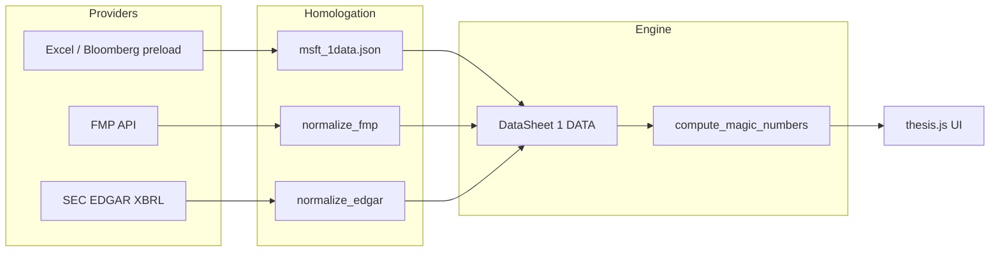

# Project structure — Financial Thesis Tool

One engine, one canonical input shape (`1 DATA` JSON), multiple **data providers**.

```
value-investing-analyzer/
├── start.bat                    # uvicorn on :8001
├── docs/
│   ├── PHASE1.md                # Excel parity goals
│   ├── ARCHITECTURE.md          # this file
│   ├── FMP_HOMOLOGATION.md      # paid/free FMP path
│   └── EDGAR_HOMOLOGATION.md    # free SEC path
├── backend/
│   ├── main.py                  # API: ?source=preload|fmp|edgar
│   ├── .env                     # FMP_API_KEY, SEC_USER_AGENT (gitignored)
│   ├── data/                    # saved snapshots (not all required at runtime)
│   │   ├── msft_1data.json      # Excel/Bloomberg reference (preload)
│   │   ├── msft_fmp_1data.json
│   │   ├── aapl_fmp_1data.json
│   │   └── aapl_edgar_1data.json
│   ├── services/
│   │   ├── one_data_schema.py   # row contract (Excel row numbers)
│   │   ├── one_data_common.py   # shared MLN / % diff helpers
│   │   ├── magic_numbers.py     # ENGINE — tables + chart_sections
│   │   ├── fmp_provider.py      # FMP stable API fetch
│   │   ├── normalize_fmp.py     # FMP → 1 DATA
│   │   ├── edgar_provider.py    # SEC companyfacts fetch
│   │   └── normalize_edgar.py   # XBRL → 1 DATA
│   ├── scripts/
│   │   ├── fetch_fmp_ticker.py
│   │   ├── fetch_edgar_ticker.py
│   │   └── compare_sources.py   # FMP vs EDGAR % variation
│   └── static/                  # display only (thesis.js, no business logic)
```

## Data flow



**Rule:** Never duplicate Magic Numbers or chart math in the frontend or in a provider.  
Each provider only maps external facts → `grid` + `years` JSON.

## API sources

| `?source=` | Cost | Use case |
|------------|------|----------|
| `preload` (default) | — | MSFT from Excel snapshot |
| `fmp` | ~$22/mo Starter (5–12 yrs) | Broad ticker coverage, fast |
| `edgar` | Free | US SEC filers, audit trail |

Examples:

- `GET /api/thesis/MSFT?source=fmp`
- `GET /api/thesis/AAPL?source=edgar`
- Browser: `http://127.0.0.1:8001/?ticker=AAPL&source=edgar`

## Adding a new provider

1. `services/{name}_provider.py` — fetch raw payload.
2. `services/normalize_{name}.py` — output same JSON as `msft_1data.json`.
3. Wire `source={name}` in `main.py`.
4. Add `scripts/fetch_{name}_ticker.py` + row in `compare_sources.py` if benchmarking.

## What not to split

- **Do not** create separate `magic_numbers_fmp.py` / `magic_numbers_edgar.py`.
- **Do not** store provider-specific columns in the engine.
- **Do** keep fiscal alignment in the normalizer (`years[].fy`, `years[].end_date`).
